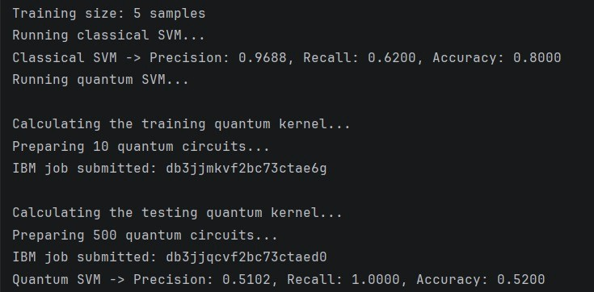
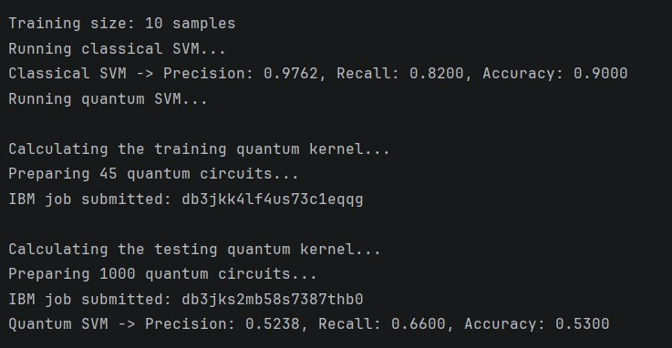
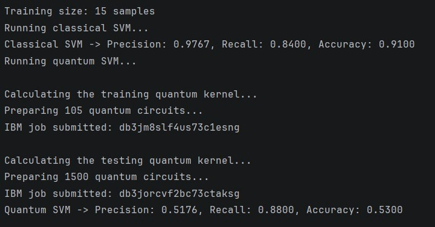
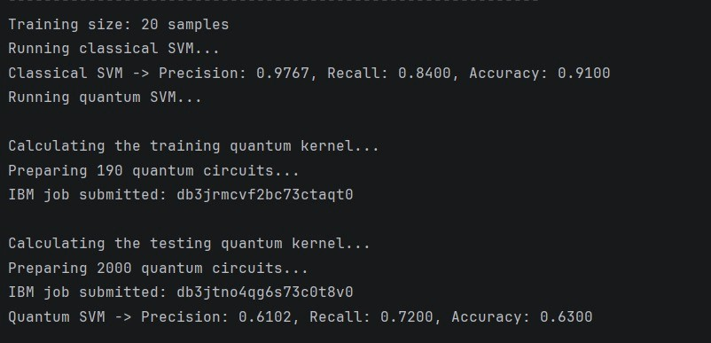
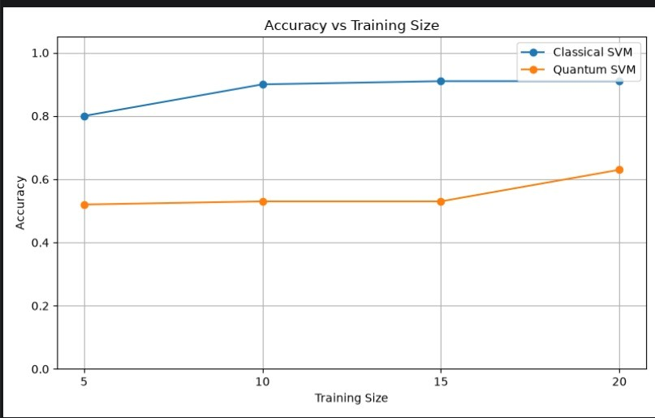
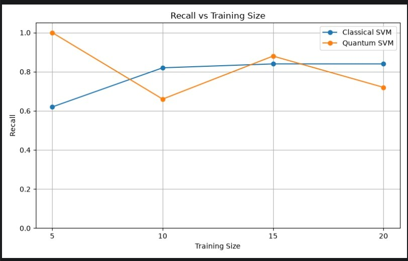
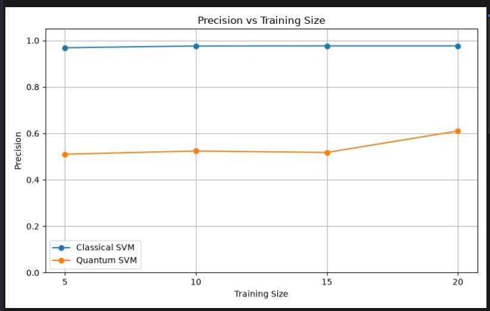

## Details of the project

This is a project done for the hackathon for the quantum fest 2026 - Quantum Build Challenge

In this project, we will be comparing the classical SVM and quantum SVM across different training and testing dataset sizes from the dataset [Credit Card Fraud Detection](https://www.kaggle.com/datasets/mlg-ulb/creditcardfraud)

My code supports a quantum computer simulator-Qiskit Aer and an actual remote quantum computer from IBM

You can change the model used by changing the string input for `QUANTUM_BACKEND` to either ibm or aer depending on whether if you want to use Qiskit Aer or your IBM remote quantum computer

If you are using IBM computer, you must input your API key in IBMSave.py and run it once before executing main.py

I have used smaller training sets due to the usage limit for the IBM remote quantum computer but made sure to use larger datasets to test the models properly on a wide variety of inputs to check their robustness

The following are the outputs I have obtained after executing my code:

As we can see, the classical SVM clearly outperforms the quantum SVM, however we can also observe a few other facts:
accuracy and precision seem to be increasing as the training sizes increase
recall score, however seems to be fluctuating without regard to the training dataset and is the only metric in which the quantum SVM outperformed classical SVM in certain instances

### Note:
The images inside the image folder were added purely to be used in this file and aren't created by the program itself, the program creates other files that represents the accuracy, precision and recall comparisons as well as the training size results